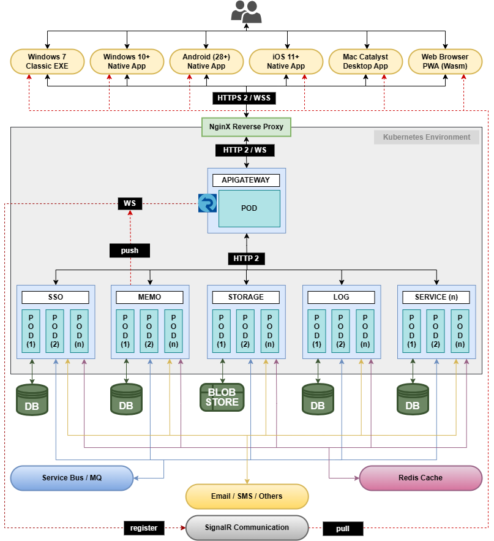

# 10X
  
[&mdash; EVERYTHING YOU NEED &mdash;]  
[&mdash; THE ULTIMATE SOLUTION &mdash;]

**10X** is a highly scalable microservice architecture build on top of the dotnet7. REST with OpenAPI integrated backend and blazor(wasm+maui+exe) as frontend.

# Development Prerequisite
**Hardware Requirement**
1.  8 core/16 thread processor or higher (high TDP cpu is better)
2.  32 GB of RAM (3200 mhz) or higher
3.  30 GB of disk space (M.2 SSD) or higher
4.  Full HD display
5.  Dedicated graphics (optional)

**Software Requirement**
1.  Windows 10/11 or higher with PowerShell updates
2.	Visual Stodio 2022 or higher (with latest updates) [(download)](https://visualstudio.microsoft.com/vs/)
3.  Windows subsystem for linux (configure from windows features) [(download)](https://wslstorestorage.blob.core.windows.net/wslblob/wsl_update_x64.msi)
4.	Docker Desktop [(download)](https://www.docker.com/products/docker-desktop/)
5.	Sql Server Management Studio [(download)](https://learn.microsoft.com/en-us/sql/ssms/download-sql-server-management-studio-ssms?view=sql-server-ver16)
6.	Redis Desktop Manager [(download)](https://redis-desktop-manager.software.informer.com/download/)
7.  MongoDB Compass [(download)](https://www.mongodb.com/try/download/compass)
8.  Azure CLI [(download)](https://azcliprod.blob.core.windows.net/msi/azure-cli-2.29.0.msi)
9.  Git for Windows (only for dev sanity testing) [(download)](https://github.com/git-for-windows/git/releases/download/v2.41.0.windows.1/Git-2.41.0-64-bit.exe)
10. .Net 7 SDK (only of dev sanity testing) [(deonload)](https://dotnet.microsoft.com/en-us/download/dotnet/thank-you/sdk-7.0.305-windows-x64-installer) 

# Solution Architecture
| Architecture | Description |
| ------------ | ----------- |
|  | Let's start with brief description of architecture...  **app.native**: Cross-platform native app for android / Windows / iOS / MacCatalyst / Tizen **app.web**: Progressive web application (wasm) **app.win**: Classic windows application (exe) **client.common**: Core dependencies and common functionalities for frontend apps **pubsub.common**: Inter-service communication data models / messages **server.common**: Core dependencies(infrastructure) and common functionalities for backend services **win.setup**: Classic windows exe installer (console application) **sso.client**: Isolated micro-frontend service, contains UI / UX for SSO operations (vertical sliced architecture) **sso.server**: Isolated micro-backend service for SSO operations (rest-api microservice) **sso.shared**: Frontend-backend communication data models &amp; validations **sso.test**: Data validation &amp; business logic execution test cases **apigateway**: Request entry point to proper service through route-redirection (L7 load balancer) including bi-directional websocket connection using signalr  **docker-compose**: Docker image + container and runtime configuration for development environment including tests  [*note: Each isolated micro-service contains four projects. like SSO, memo log and storage are individual services*]   |

# Build Automation
  
These feature are fully/partly automated during any phase of development to deployment

# Cloud-Environment &amp; Dataflow Diagram

# Coding Guideline/Rules
**Backend:** Clean architecture with TDD  
**Frontend:** Vertical slice architecture  
*[Maintain following rules as coding guideline]*
1.  Use proper naming convention. Don't use short form or abbreviation. Use verbs to naming method/function.
2.  Don't use unnecessary prefix or suffix. Use prefix on boolean types only (is,has).
3.  Don't write comments, instead write readable code. Use summary comments only.
4.  Don't write method/function with multiple parameter arguments (max 7). Use sealed record instead.
5.  Don't pass boolean variable as method/function argument, instead write two separate methods.
6.  Avoid magic numbers or hard-coded values. Use constant and separate them from the core business logic.
7.  Use optional parameter with default value to avoid short-circuit result.
8.  Don't write large code files (max 500 lines).
9.  Isolate actual business logic using interface, but don't do unnecessary loose-coupling with multiple layers.
10. Make sure generic base class method/function(s) should be virtual, that can be easily override when required.
11. Avoid nested conditions and looping to reduce cyclometric complexity.
12. Split business logic into multiple methods where each method performs only one task.
13. Never write a large method (max line should be 60).
14. Always use sealed class if there is no inheritance.
15. Implement IDisposable where possible.
16. Never use Thread operations unless it is very much required.
17. Always write proper test(s) for business logic (more test case = more accuracy).
18. Accept all warnings as error.
19. Be careful and conscious on threads and loops like when to use for, when foreach, when parallel tasks etc.
20. Always prefer to use stack memory when possible, rather than heap.
21. Declare variable at lowest scope when possible.
22. Dont use var/auto, instead use proper datatypes.
23. Create small reusable components.
24. Do a honest code review and pass test(s) before any Pull-Request or CI/CD or Deployment.
25. If possible write benchmark-test and run profiler to confirm optimization of process.

# K6 Testing (load/spike/stress)
  
**## 1200 users | 18 minuts | 0.7(+) million requests | 99.8%(+) success | 82%(+) optimized result**

# Sonarqube Analysis
 

# Monitoring (prometheus + grafana + aks-dashboard)

# Repository Branching

1. **Developer guideline:** Pull *MAIN* branch from remote -> Create *FEATURE* branch in local (from main) -> Start coding in *FEATURE* branch -> Run test cases -> Run sonar analysis -> Make sure code coverage (94%+) -> Commit and push *FEATURE* branch -> Pull *DEV SANITY* from remote -> Marge *FEATURE* branch to *DEV SANITY* -> Push *DEV SANITY* branch to remote -> Assign qa for manual testing -> (When qa approved) Create/modify business-flow-diagram using draw.io -> Commit and push *FEATURE* branch to remote -> Create PR to marge with *MAIN* branch and assign to same qa person for approval **(Always pull latest MAIN branch before creating a FEATURE branch. Always pull latest DEV SANITY branch before marging FEATURE branch)**
2. **Tester/QA guideline:** Pull *DEV SANITY* branch from remote -> Start testing (local environment) -> (When issue found) Create bug and move story back to developers plate -> (When test finished) Validate sonar analysis -> Approve the story -> (When PR created) Validate business-flow-diagram -> Approve the PR -> Move story to done/finish -> Keep a common(shared) note about the story for later discussion (required before cloud promotion and/or retrospective)
 
# Misc.
Azure VM Comparison [(here)](https://azureprice.net)  
Azure pipeline parallelism request [(here)](https://aka.ms/azpipelines-parallelism-request)

  
  
**Let's start...**  
**Happy coding...**